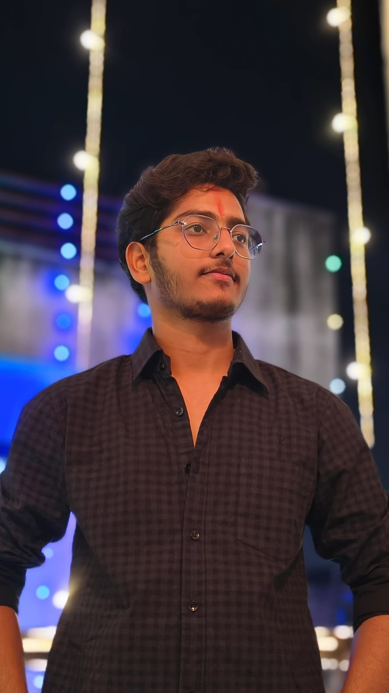

# 🚀 Mukund Khandelwal | AI & Data Science Portfolio

<div align="center">
  
  <h3>Data Scientist | Python Backend Developer | AI Enthusiast</h3>
  
  <p align="center">
    <a href="https://mukundkhandelwal.netlify.app/"><strong>Explore Live Site »</strong></a>
    <br />
    <br />
    <a href="https://linkedin.com/in/mukund-khandelwal-6a8663283">LinkedIn</a>
    •
    <a href="https://github.com/mukundkhandelwal463">GitHub</a>
    •
    <a href="mailto:mukundkhandelwal463@gmail.com">Email</a>
  </p>
</div>

---

## 🌟 Overview

Welcome to my professional portfolio! This project showcases a blend of **Data Science**, **Machine Learning**, and **Full-Stack Development**. The website features a cutting-edge **Dark Mode** and a premium **Light Mode**, built with a focus on immersive animations and high-performance UX.

### 🔗 Live Demo
Check out the live version here: [**mukundkhandelwal.netlify.app**](https://mukundkhandelwal.netlify.app/)

---

## ✨ Features

- 🌓 **Dual-Theme Architecture**: Seamless toggle between a tech-focused Dark Mode and a nature-inspired Light Mode.
- 🎭 **Smooth Animations**: Powered by **GSAP** and **Lenis Scroll** for a truly premium feel.
- 📱 **Fully Responsive**: Optimized for every device, from mobile to ultra-wide monitors.
- 🎓 **Digital Credentials**: Integrated QR code verification for professional certifications.
- 📄 **Dynamic Projects**: Floating project cards with interactive tech-stack badges.

---

## 🛠️ Technical Stack

- **Frontend**: HTML5, Vanilla CSS, Tailwind CSS
- **Interactions**: GSAP (GreenSock Animation Platform), ScrollTrigger, Lenis
- **Backend/Data Science Skills (Demoed in Projects)**:
  - Python (Flask, Django)
  - Machine Learning (Scikit-learn, Random Forest, XGBoost)
  - NLP (spaCy, NLTK)
  - Data Visualization (Power BI, Streamlit)

---

## 📂 Project Structure

```bash
├── assets/          # Project images, profile photo, and QR codes
├── index.html       # Main entry point (Dark Mode)
├── light.html       # Custom-built Light Mode experience
├── mukund cv.pdf    # Professional Resume
├── style.css        # Global styles and custom animations
└── README.md        # You are here!
```

---

## 🚀 Projects Highlights

1.  **RoyalWheels**: A Full-Stack Vehicle Rental Platform built with Django.
2.  **AI Resume Analyzer**: NLP-driven resume parsing and ATS scoring pipeline.
3.  **Accident Severity Prediction**: ML model predicting road hazards in real-time.
4.  **Netflix Data Dashboard**: Immersive Power BI analysis of global streaming trends.

---

## 📧 Contact Me

I'm always open to discussing new projects, creative ideas, or opportunities to be part of your vision.

- **Location**: Dausa, Rajasthan, India
- **Phone**: +91 63764 47286
- **Linktree**: [Connect with me](https://mukundkhandelwal.netlify.app/)

---
<div align="center">
  <sub>Built with ❤️ by Mukund Khandelwal. © 2026</sub>
</div>
